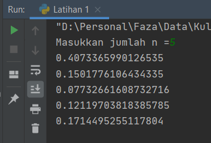
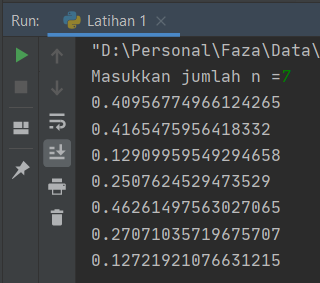
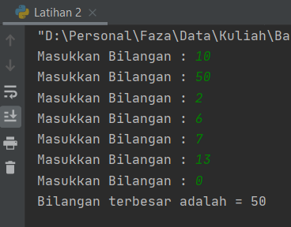
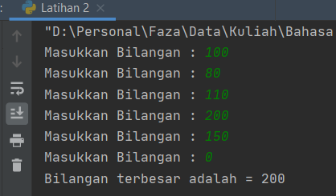
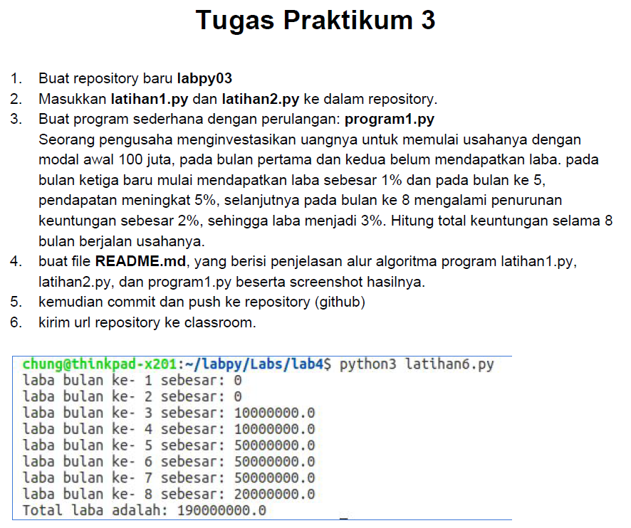
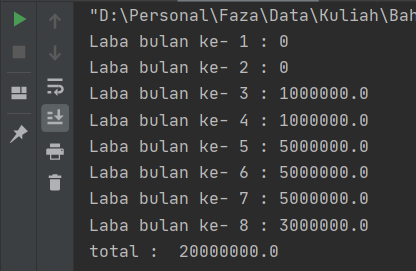

# labspy03

**Nama    : Faza Ardan Kusuma<br>
NIM     : 312010001<br>
Kelas   : TI.20.B1**

## Pertemuan 7 - Tugas Praktikum 3

Pada tugas 3 di pertemuan 7 ini, diberikan 3 program, yaitu :

| No | Description | Link |
|----|----|----|
| 1 | Latihan 1 | [Clik Here](#pertemuan-7---tugas-praktikum-3) |
| 2 | Latihan 2 | [Clik Here](#latihan-2) |
| 3 | Program 1 | [Clik Here](#program-1) |

## Latihan 1
Berikut adalah soal latihan 1

<br>

Pada latihan 1 ini, saya disuruh membuat bilangan acak dengan nilai kurang dari 0.5, dengan menggunakan kombinasi while dan for dan menggunakan fungsi random.

**For dan While**<br>
* For disebut <i>counted loop</i> (perulangan yang terhitung)
* While disebut <i>uncounted loop</i> (perulangan yang tak terhitung)<br>

Perbedaannya adalah perulangan for biasanya digunakan untuk mengulangi kode yang sudah diketahui banyak perulangannya. Sementara while untuk perulangan yang memiliki syarat dan tidak tentu berapa banyak perulangannya.

**Random**<br>
Random berfungsi untuk mengacak sebuah bilangan


Untuk latihan 1 saya menggunakan syntax sebagai berikut :
```python
import random
n = int(input ("Masukkan jumlah n ="))

for i in range (n):
    while 1:
        n = random.random()
        if n < 0.5 :
            break
    print(n)
```

Penjelasan :<br>

* Variabel i berfungsi untuk menampung indeks<br>
* Fungsi dari ***range(n)***, berfungsi untuk membuat list dengan range sesuai dengan yang angka yang di inputkan ***(n)***<br>
* ***while 1:*** berfungsi untuk, menyatakan kondisi 1 <br> 
* Kondisi 1 dengan syntax :
```python
    while 1:
        n = random.random()
        if n < 0.5 :
            break
```
* Maka dengan kondisi tersebut bahwa 1 = bernilai random dibawah 0.5 dengan fungsi ***random()*** dan ***if n < 0.5***
* ***Break*** untuk mencegah terjadinya looping tak terhingga

Hasil dari output source code latihan 1 :<br>
> Jika n = 5, maka outputnya akan menjadi 5:<br>
><br>
> Jika n = 7 , maka outputnya akan menjadi 7 baris :<br>
><br>


## Latihan 2
Pada latihan 2, soalnya sebagi berikut :
<br>

Untuk source code dari tugas 2 :
```python
x=0
while True:
    a=int(input("Masukkan Bilangan : "))
    if x<a:
        x=a
    if a==0:
        break
print("Bilangan terbesar adalah =",x)
```

Penjelasan :
* Di latihan 2 ini saya akan menggunakan ***while*** untuk pengulangannya 
* ***if*** untuk mengeksekusi jika kondisinya ***true***
* ***break*** untuk menghentikan looping
* Jadi dengan source code diatas, program baru akan berhenti ketika di inputkan angka 0, bila di inputkan selain angka 0 maka looping akan terus berlanjut<br>

Hasil dari source code latihan 2 :<br>
<br>
<br>
Itulah 2 contoh dari <i>source code</i> latihan 2 bila di run

## Program 1
Selanjutnya adalah Tugas 3 atau Program 1<br>
<br>
Pada tugas 3 kali ini adalah menghitung laba<br>

Source code untuk Tugas 3 :
```python
a = 100000000
for x in range(1,9):
    if(x>=1 and x<=2):
        b=a*0
        print("Laba bulan ke-",x,":",b)

    if(x>=3 and x<=4):
        c=a*0.01
        print("Laba bulan ke-",x,":",c)

    if(x>=5 and x<=7):
        d=a*0.05
        print("Laba bulan ke-",x,":",d)

    if(x==8):
        e=a*(0.03)
        print("Laba bulan ke-",x,":",e)

total=b+b+c+c+d+d+d+e
print("total : ",total)
```
Penjelasan :
* a = 100000000 adalah modal awal Rp 100.0000.000,-
* Gunakan fungsi ***for*** untuk pengulangan dan ***range(1,9)*** untuk membuat list dari bulan 1 sampai 9
* ***if(x>=1 and x<=2)***, syntax tersebut berfungsi untuk menghitung dari bulan yang ditentukan, misal untuk syntax tersebut berarti hanya bulan pertama dan kedua
* <i>b=a*0</i>, syntax tersebut untuk menghitung laba yang di dapat, b adalah hasil dari laba. Untuk bulan pertama masih di kalikan 0 karena tidak ada laba, untuk bulan kedua yaitu c sudah ada laba maka dikalikan sesuai dengan laba, dan seterusnya
* Untuk bulan ke 8 ada penurunan laba sebesar 2% maka pengaliannya turun yang semulanya adalah 0.05 menjadi 0.03
* ***total=b+b+c+c+d+d+d+e***, syntax tersebut untuk menjumlahkan total laba yang di dapat dari bulan pertama sampai bulan kedelapan
* ***print("total : ",total)***, syntax tersebut untuk menampilkan hasil dari penjumlahan laba<br>

Output dari Source code diatas adalah <br>
<br>

Hasilnya ***berbeda*** dengan apa yang ada pada tugas 3, karena :
* Pertama, yang ditampilkan di tugas 3 adalah labanya 10%, 50% dan 20%, yang seharusnya 1%, 5% dan 3%, jadi yang ditampilkan pada tugas labanya berupa puluhan juta, bukan, jutaan
* Kedua hasil pada laba ke 8, pada tugas 3 dikalikan dengan 20% bukannya 3%, karena dari 5 - 2 adalah 3

**================================================================**<br>
**=========================FAZA ARDAN KUSUMA=======================**<br>
**=============================312010001===========================**<br>
**==============================TA.20.B1===========================**<br>
**============================TERIMA KASIH=========================**<br>
**================================================================**